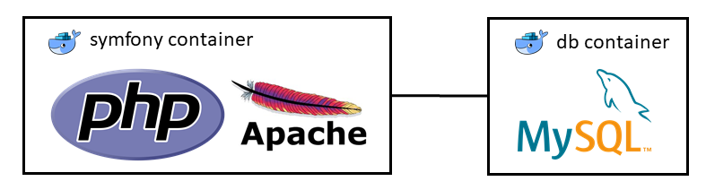

# Symfony 4.x Docker Blueprint (PHP7 - Apache - MySQL)



## Installation

1. Create a .env from the .env.dist file. Adapt it according to your symfony application

    ```bash
    $ cp .env.dist .env
    ```

2. Build/run containers with detached mode

    ```bash
    $ docker-compose build
    $ docker-compose up -d
    ```

3. Prepare Symfony app

    ```bash
    $ docker exec -it symfony-project composer install
    $ docker exec -it symfony-project php bin/console doctrine:database:create
    ```

## Local development

Please follow the same steps as during the installation (except docker-compose up -d). To start your containers do the following:

    $ docker-compose -f docker-compose-dev.yml up -d

You can edit your symfony-project in ./symfony-project folder. After finishing development you have to rerun step 2 and 3 from installation.

## Call the example

Visit [http://hostname:8088/lucky/number](http://hostname:8088/lucky/number)
